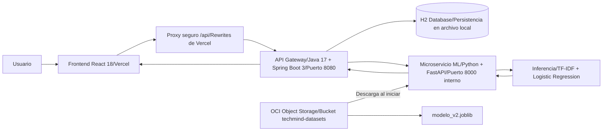

# 🧠 TechMind — Clasificación Inteligente de Documentación Técnica

> Proyecto desarrollado para **No Country — Hackathon ONE G9 (Alura + Oracle)**.
> **Grupo 9 · LATAM · Equipo 07**

[](https://g9-latam-team-07-zeta.vercel.app) [](http://146.181.61.160:8080)    

## Propuesta de valor

El conocimiento técnico de una organización suele quedar fragmentado y disperso entre manuales, procedimientos, incidentes, notas y consultas repetidas. Clasificar ese material es una tarea que casi nadie hace de forma consistente; y buscar solo funciona cuando ya se conoce la palabra exacta que contiene el documento.

**TechMind** automatiza esa primera capa de organización. Recibe documentación técnica, predice su categoría, informa un nivel de confianza y extrae palabras clave para que el conocimiento sea más fácil de encontrar, reutilizar y mantener.

El modelo clasifica en ocho categorías:

- Backend
- Frontend
- Data Science
- Machine Learning
- DevOps
- Cloud
- Cybersecurity
- Bases de Datos

### Privacidad por diseño

El modelo, los datos y los servicios están desacoplados y desplegados en infraestructura propia de **Oracle Cloud Infrastructure (OCI)**. El contenido procesado no viaja a proveedores de terceros para realizar la inferencia.

## Arquitectura y flujo de datos



1. El usuario envía un título y un texto desde el frontend React desplegado en Vercel.
2. Vercel enruta `/api/*` mediante un proxy seguro hacia el backend, resolviendo el consumo HTTPS hacia el servicio HTTP de OCI.
3. La API Java valida el request, solicita la inferencia al microservicio FastAPI y guarda el resultado en H2.
4. FastAPI carga `modelo_v2.joblib` desde el bucket `techmind-datasets` al iniciar, vectoriza el texto con TF-IDF y ejecuta la clasificación.
5. La respuesta vuelve por Java hacia el frontend con categoría, confianza y palabras clave.

## 🛠️ Stack Tecnológico

- **Frontend:** HTML, CSS, JavaScript / Framework Moderno React.
- **Backend (API REST):** Java, Spring Boot.
- **Servicio IA (Predict):** Python, FastAPI, Uvicorn.
- **Data Science / Machine Learning:** Python, Pandas, Scikit-Learn, Joblib, Google Colab.
- **Almacenamiento de Modelos:** OCI Object Storage.
- **Infraestructura / Deploy:** OCI Compute (Instancia Ubuntu Linux), Docker Compose.
- **Gestión y Control de Versiones:** Git, GitHub, Trello (Scrum).

## API REST

### `POST /contenido`

Clasifica y persiste un contenido técnico. El título y el texto son obligatorios y, combinados, deben sumar al menos 10 caracteres.

#### Request

```json
{
  "titulo": "Oracle Cloud Infrastructure Compute and Object Storage Setup",
  "texto": "Configuration of OCI Compute instances and Object Storage buckets for a production workload."
}
```

#### Response

```json
{
  "categoria": "Cloud",
  "probabilidad": 0.99,
  "informacion_adicional": ["Oracle Cloud", "OCI", "Compute", "Object Storage"]
}
```

#### Ejemplos reales de clasificación

| Contenido | Categoría | Confianza | Palabras clave destacadas |
| --- | --- | --- | --- |
| `Oracle Cloud Infrastructure Compute and Object Storage Setup` | Cloud | `0.99` | Oracle Cloud, OCI, Compute, Object Storage |
| `Automated CI/CD Pipelines with GitHub Actions and Docker` | DevOps | `0.99` | CI/CD, GitHub Actions, Docker, Pipelines |
| `Training Transformer Models with PyTorch` | Machine Learning | `0.99` | Transformer, Models, PyTorch, Training |

Ejemplo de respuesta para DevOps:

```json
{
  "categoria": "DevOps",
  "probabilidad": 0.99,
  "informacion_adicional": ["CI/CD", "GitHub Actions", "Docker", "Pipelines"]
}
```

Ejemplo de respuesta para Machine Learning:

```json
{
  "categoria": "Machine Learning",
  "probabilidad": 0.99,
  "informacion_adicional": ["Transformer", "PyTorch", "Models", "Training"]
}
```

### `GET /contenido`

Devuelve el historial de contenidos clasificados y almacenados en H2:

```bash
curl http://localhost:8080/contenido
```

El resultado incluye `id`, `titulo`, `texto`, `categoria`, `probabilidad`, `informacionAdicional` y `fechaRegistro` para cada registro.

### `GET /contenido?categoria=Cloud`

Filtra el historial por categoría, ignorando diferencias entre mayúsculas y minúsculas:

```bash
curl "http://localhost:8080/contenido?categoria=Cloud"
```

### Manejo de errores

La API utiliza `@RestControllerAdvice` para devolver respuestas uniformes y no exponer detalles internos.

**HTTP 400 — validación por contenido menor a 10 caracteres**

```json
{
  "timestamp": "2026-08-23T12:00:00Z",
  "status": 400,
  "error": "Bad Request",
  "message": "Error de validación",
  "path": "/contenido",
  "detalles": [
    {
      "campo": "longitudMinimaValida",
      "mensaje": "El contenido combinado de 'titulo' y 'texto' debe tener al menos 10 caracteres"
    }
  ]
}
```

**HTTP 503 — caída del servicio de inferencia**

```json
{
  "timestamp": "2026-08-23T12:00:00Z",
  "status": 503,
  "error": "Service Unavailable",
  "message": "Servicio de clasificación no disponible",
  "path": "/contenido",
  "detalles": null
}
```

## Ejecución local

Se requieren **Python 3.11**, **Java 17**, **Maven** o Maven Wrapper, **Node.js** y **npm**.

### 1. Microservicio ML

Desde la raíz del repositorio:

```bash
cd model-service
python -m venv venv
source venv/bin/activate
pip install -r requirements.txt
uvicorn main:app --host 0.0.0.0 --port 8000
```

En Windows PowerShell, activar el entorno con:

```powershell
.\venv\Scripts\Activate.ps1
```

### 2. API Java

En una segunda terminal:

```bash
cd api-java
./mvnw clean spring-boot:run
```

La API queda disponible en `http://localhost:8080`.

### 3. Frontend

En una tercera terminal:

```bash
cd frontend
npm install
npm run dev
```

La interfaz queda disponible en `http://localhost:5173`.

## Despliegue en producción

### Oracle Cloud Infrastructure

- **Compute:** instancia Ubuntu Linux con el backend Java y el microservicio ML.
- **Red:** la Security List permite los puertos `22` (administración SSH) y `8080` (API pública). El puerto `8000` permanece cerrado al exterior y solo se utiliza para el consumo interno entre servicios.
- **Persistencia:** H2 mantiene los registros en un archivo local mediante `jdbc:h2:file:./data/techmind`.
- **Object Storage:** el bucket seguro `techmind-datasets` almacena el artefacto `modelo_v2.joblib`. FastAPI lo descarga durante el arranque para cargarlo en memoria.

### Vercel

El frontend se publica en:

<https://g9-latam-team-07-zeta.vercel.app>

El archivo `vercel.json` define un proxy inverso para `/api/:path*` hacia `http://146.181.61.160:8080/:path*`. Este rewrite evita el problema de **Mixed Content** al consumir desde el frontend HTTPS la API desplegada en HTTP.

## 📊 Estado del Proyecto — Roadmap de Sprints

Trabajamos bajo metodología Scrum en Sprints de 1 semana, gestionado en Trello con criterios DoD y DoR.

- **Sprint 1:** Arranque del proyecto. Creación del entorno, etiquetado del dataset inicial, análisis exploratorio (EDA) preliminar, y creación del primer endpoint `POST /contenido` (con *mock*) en Java. Despliegue base en OCI iniciado.
- **Sprint 2:** Limpieza final del dataset. Validación de la API en Java incorporando manejo de errores. Construcción del esqueleto del microservicio FastAPI y despliegue del contrato de comunicación verificando la comunicación Java ↔ Python con un modelo temporal.
- **Sprint 3:** Entrenamiento y optimización real del modelo en Colab. Exportación a OCI Object Storage. Integración final en FastAPI cargando el artefacto `.joblib` real, consolidando el endpoint `POST /predict`.
- **🚀 Sprint 4:** **Desarrollo e Integración del Frontend.** Construcción de la interfaz gráfica web para destacar el proyecto en la Hackathon. Integración end-to-end (Frontend → Java → Python) asegurando que el usuario pueda interactuar de manera natural con el modelo de clasificación.
- **🏁 Sprint 5:** Refinamiento final, ensayos para la presentación y demostración funcional completa (preparación del pitch).

### Equipo Team 07

El trabajo se organizó por áreas complementarias:

* **Data Science:** Preparación del dataset, análisis exploratorio (EDA), entrenamiento y exportación del modelo de clasificación (HU-02 a HU-06).
* **Backend Java:** API REST, validaciones de esquemas, orquestación con FastAPI, persistencia en base de datos H2 y manejo global de errores (HU-08 a HU-10).
* **Frontend React:** Interfaz interactiva de clasificación, visualización de resultados en tiempo real y vista de consulta de documentos (*Ask Your Docs*).
* **Cloud / DevOps:** Infraestructura en OCI Compute, redes y seguridad de puertos, Object Storage, despliegue y proxy inverso en Vercel (HU-01, HU-11).
* **Scrum / PM:** Organización de sprints, coordinación del equipo, seguimiento de criterios DoR/DoD y preparación del pitch de presentación (HU-01, HU-12, HU-13).

## Cierre

> **Nadie encuentra nada en una biblioteca sin catálogo. Nosotros construimos lo que cataloga, y ya funciona.**